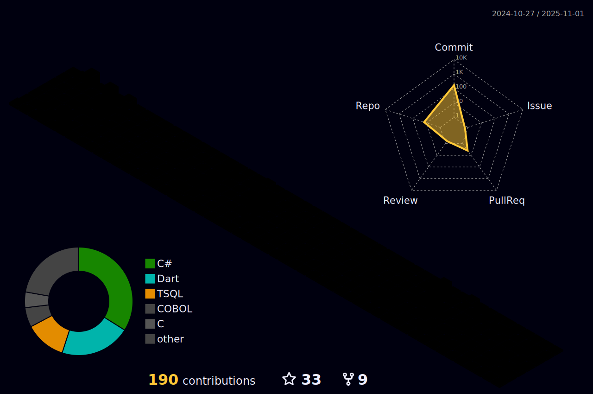

<!---======================================================================= This is the title ============================================================--->
<h1 align="center"> &ltHello dev/&gt;, I'm <a href="https://luis-fernando-dev.vercel.app/">Luis</a>!</h1>

- 💻 I've a degree in Systems Development at the ETEC (Escola Técnica de Embu // Technical School - Embu)
- 💻 I'm studying Computer Science at UNASP
- 🔠 I've B1 Intermediate in English at EF SET - Education First // <a href="https://www.efset.org/cert/9PZnG8">Certificate</a>
- 🔠 I study English in Duolingo
- 🔥 I really like Javascript, your frameworks and libraries
- 🎮 I love so much videogames
- 🙏✝ I am part of the <a href="https://github.com/buscafe">BuscaFé</a> project (ETEC)
- 🔥 Here is my portfolio to see my built projects: <a href="https://luis-fernando-dev.vercel.app/">https://luis-fernando-dev.vercel.app/</a>

<!---======================================================================================================================================================--->
***

<!---============================================================= My Stacks - Languages and IDE ==========================================================--->

  
  
  
  
  
  
  
  
  
  
  
  
  
  
  
  

 
<h2 align="center"> My Favorites</h2>

  
  
  
  
  
  

 
 

<!---======================================================================================================================================================--->

  
<!---======================================================================= Github Stats =================================================================--->

  

    
        

<!---======================================================================================================================================================--->

  
  <!---===================================================================== Social Media ===================================================================--->

  <h1>Social Media</h1>
  
    
LinkedIn
 

    
Instagram
 
  
   
Gmail
 

    
  
  
  

 
<!---======================================================================================================================================================--->

  

<h3>My Package Managers</h3>

 NPM

 Yarn
